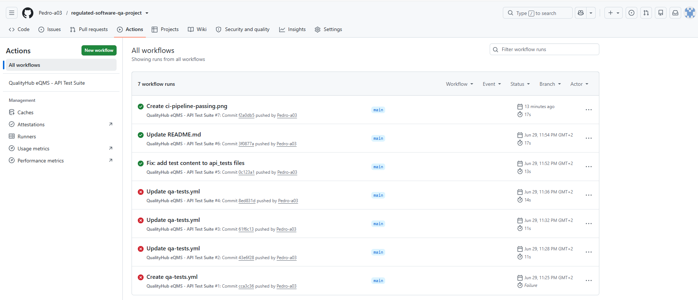
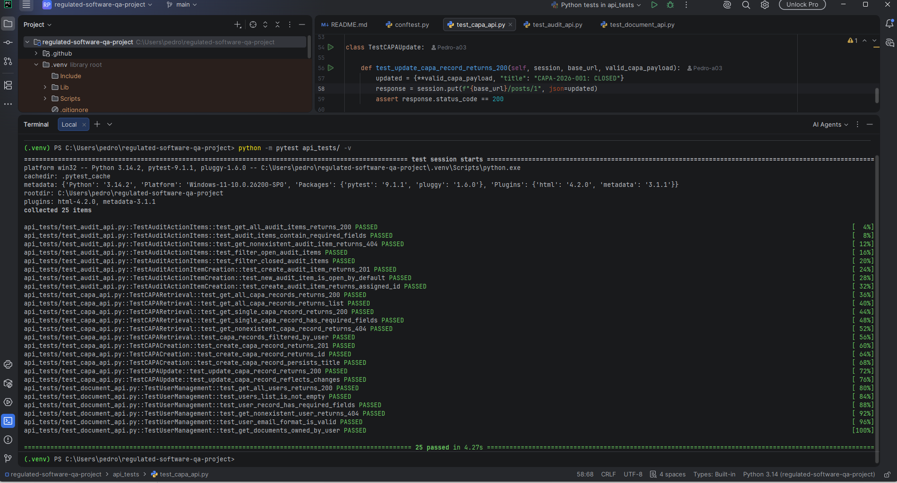

# regulated-software-qa-project

### QA Test Plan & API Automation | eQMS Software | EU MDR / ISO 13485 / IEC 62304


---

## About This Project

**Challenge:** Demonstrate senior-level QA thinking applied to regulated software — combining a formal test plan aligned with ISO 13485, EU MDR, and FDA 21 CFR Part 11 with a modern API automation suite and CI/CD pipeline.

**My Role:** Designed the full test plan for a fictional eQMS, mapping every test case to its corresponding regulatory clause. Built 25 automated API tests in Python/pytest covering CAPA management, audit trail integrity, and document control. Configured a GitHub Actions CI/CD pipeline that executes the full suite on every push.

**Tools:**


**Outcome:** Delivered a fully automated, CI/CD-enabled QA project with a live passing badge on GitHub. Every test case is traceable to a regulatory requirement — the same traceability standard required in medical device software validation. Pipeline executes 25 tests in under 15 seconds on every push.

**Why eQMS?**
eQMS platforms (such as Veeva Vault, Greenlight Guru, MasterControl) are widely used by medical device manufacturers, pharma companies, and precision manufacturing firms. Understanding how to test these systems from both a regulatory and technical perspective is a key differentiator.

**What makes this project different:**
Junior QA profiles can test features. This project tests *compliance requirements* — audit trail immutability, RBAC enforcement, document ownership traceability — framing every test case against the regulatory clause it validates.

---

## Visual Evidence

### CI/CD Pipeline — GitHub Actions
Every push to `main` triggers the full test suite automatically. The following shows consecutive successful runs confirming pipeline stability.



### Test Execution — 25 Tests Passing
Full pytest output showing all 25 test cases passing across CAPA, Audit Trail, and Document Control modules.



---

## Repository Structure

regulated-software-qa-project/
|
+-- README.md                        # Test Plan + Project Overview
+-- .github/
|   +-- workflows/
|       +-- qa-tests.yml             # GitHub Actions CI/CD pipeline
|
+-- api_tests/
|   +-- requirements.txt             # Python dependencies
|   +-- conftest.py                  # pytest fixtures and configuration
|   +-- test_capa_api.py             # CAPA module tests (11 test cases)
|   +-- test_audit_api.py            # Audit trail tests (8 test cases)
|   +-- test_document_api.py         # Document control tests (6 test cases)
|
+-- docs/
|   +-- screenshots/                 # Visual evidence
|       +-- ci-pipeline-passing.png
|       +-- pytest-results-25-passed.png
|
+-- test_cases/
|   +-- QualityHub_Test_Cases.md
|
+-- bug_reports/
+-- Bug_Report_Template.md

---

## CI/CD Pipeline

Every push to `main` triggers the full test suite automatically via GitHub Actions.

The pipeline:
1. Spins up an Ubuntu runner
2. Installs Python 3.11 and dependencies
3. Executes all 25 pytest test cases with verbose output
4. Generates and uploads an HTML test report as a build artifact

---

## Test Plan — QualityHub eQMS

### 1. Introduction

| Field | Details |
|-------|---------|
| **Project Name** | QualityHub — Electronic Quality Management System |
| **Document Version** | 1.0 |
| **Author** | Pedro Acosta |
| **Date** | June 2026 |
| **Software Safety Class** | Class B (IEC 62304) |
| **Regulatory Framework** | EU MDR 2017/745 · ISO 13485:2016 · IEC 62304:2006+A1:2015 · FDA 21 CFR Part 11 |

**Purpose:**
This test plan defines the strategy, scope, and approach for testing QualityHub v1.0, ensuring the system meets functional requirements and complies with applicable regulatory standards before release in regulated markets.

---

### 2. Scope

#### In Scope

| Module | Description |
|--------|-------------|
| CAPA Management | Create, retrieve, update, and close CAPA records with full traceability |
| Audit Trail | Immutable action item log with user attribution and status tracking |
| Document Control | User-based document ownership, access control, and contact validation |
| API Layer | RESTful endpoints for all three modules |

#### Out of Scope
- UI/UX testing (covered separately)
- Performance and load testing
- Security penetration testing

---

### 3. Test Objectives

1. Verify CAPA records are created, retrieved, and updated correctly per ISO 13485 clause 8.5.2
2. Validate audit action items enforce open/closed state transitions per audit workflow requirements
3. Confirm document ownership filtering correctly enforces access control
4. Ensure API returns appropriate HTTP status codes for valid and invalid requests
5. Verify all user records include verifiable identity fields per FDA 21 CFR Part 11.10(i)

---

### 4. Regulatory Requirements Mapped to Tests

| Requirement | Standard | Test Cases |
|-------------|----------|------------|
| CAPA records must have unique identifiers | ISO 13485 section 8.5.2 | TC-CAPA-008 |
| Systems must not silently ignore missing records | ISO 13485 section 4.2.5 | TC-CAPA-005, TC-AUDIT-003, TC-DOC-004 |
| Audit items must be attributed to responsible users | ISO 13485 section 8.8.2 | TC-AUDIT-002 |
| Open findings must be tracked to closure | ISO 13485 section 8.8 | TC-AUDIT-004, TC-AUDIT-005 |
| New audit findings must start in open state | Internal audit workflow | TC-AUDIT-007 |
| User identity must be verifiable for audit trail | FDA 21 CFR Part 11.10(i) | TC-DOC-003, TC-DOC-005 |
| System must have at least one authorized user | ISO 13485 section 4.2.4 | TC-DOC-002 |

---

### 5. Test Strategy

#### Risk-Based Approach

| Risk Level | Functions | Coverage Target |
|------------|-----------|-----------------|
| **High** | Audit trail integrity, CAPA traceability, user attribution | 100% |
| **Medium** | Record filtering, status transitions, error handling | 80% |
| **Low** | Response format, optional fields | 50% |

#### Test Types

| Type | Description | Tooling |
|------|-------------|---------|
| API Functional Testing | Validate endpoints against requirements | Python, pytest, requests |
| Negative Testing | Verify correct error responses (404, 422) | pytest |
| Filter/Query Testing | Validate record filtering by user, status | pytest |
| State Validation | Verify open/closed state logic for audit items | pytest |
| Regression | Re-run full suite on every code change | GitHub Actions CI/CD |

---

### 6. Entry and Exit Criteria

**Entry Criteria**
- [ ] API is deployed and accessible in test environment
- [ ] Test data is seeded and verified
- [ ] This test plan has been reviewed

**Exit Criteria**
- [ ] 100% of High-risk test cases executed
- [ ] 0 open Critical or High severity defects
- [ ] CI/CD pipeline passing on main branch
- [ ] Test report generated and archived

---

### 7. Test Cases Summary

| Module | Test Cases | Automated |
|--------|-----------|-----------|
| CAPA Management | 11 | 11 |
| Audit Trail | 8 | 8 |
| Document Control | 6 | 6 |
| **Total** | **25** | **25** |

---

### 8. Defect Severity Classification

| Severity | Definition | Example |
|----------|------------|---------|
| **Critical** | Regulatory compliance failure or data loss | Audit item created without user attribution |
| **High** | Core function broken, no workaround | CAPA creation returns 500 for valid payload |
| **Medium** | Function impaired, workaround exists | Filter by userId returns unfiltered results |
| **Low** | Minor issue, no functional impact | Extra whitespace in response field |

---

## API Test Automation

### Setup

```bash
git clone https://github.com/Pedro-a03/regulated-software-qa-project
cd regulated-software-qa-project
pip install -r api_tests/requirements.txt
python -m pytest api_tests/ -v
```

### Test Coverage

| File | Module | Test Cases |
|------|--------|-----------|
| `test_capa_api.py` | CAPA records (GET, POST, PUT) | 11 |
| `test_audit_api.py` | Audit action items (GET, POST) | 8 |
| `test_document_api.py` | Users and document ownership | 6 |

### API Mapping

| JSONPlaceholder endpoint | eQMS entity |
|--------------------------|-------------|
| `/posts` | CAPA records |
| `/todos` | Audit action items |
| `/users` | eQMS system users |

---

## Skills Demonstrated

| Area | Skills |
|------|--------|
| **Regulatory QA** | ISO 13485, EU MDR 2017/745, IEC 62304, FDA 21 CFR Part 11 |
| **Test Planning** | Risk-based approach, RTM, entry/exit criteria, defect classification |
| **Test Design** | Negative testing, state validation, filter/query testing, BVA |
| **API Automation** | Python 3.11, pytest, requests library, fixture management |
| **CI/CD** | GitHub Actions — automated test execution on every push |
| **eQMS Domain** | CAPA, audit trail, document control, RBAC concepts |

---

## Author

**Pedro Acosta** — Senior Quality Professional & Software QA Engineer

[](https://www.linkedin.com/in/pedro-acosta-sanchez/)
[](https://dynamic-lungfish-51b.notion.site/Pedro-Acosta-Software-QA-Engineer-30de7a2409d0802b8d1dfc2da0e10739)

> *"In regulated industries, quality is not a department — it is a system."*
